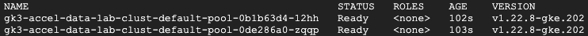
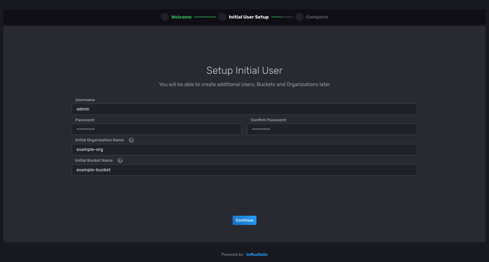
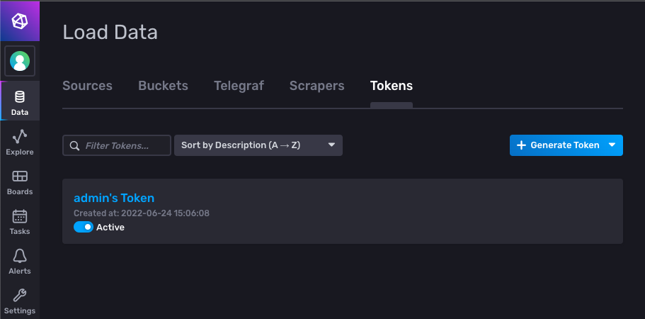
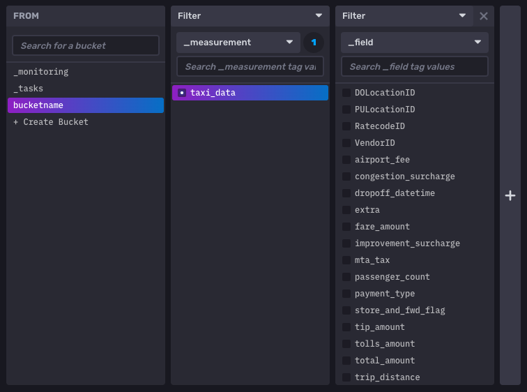
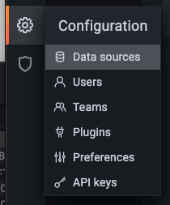
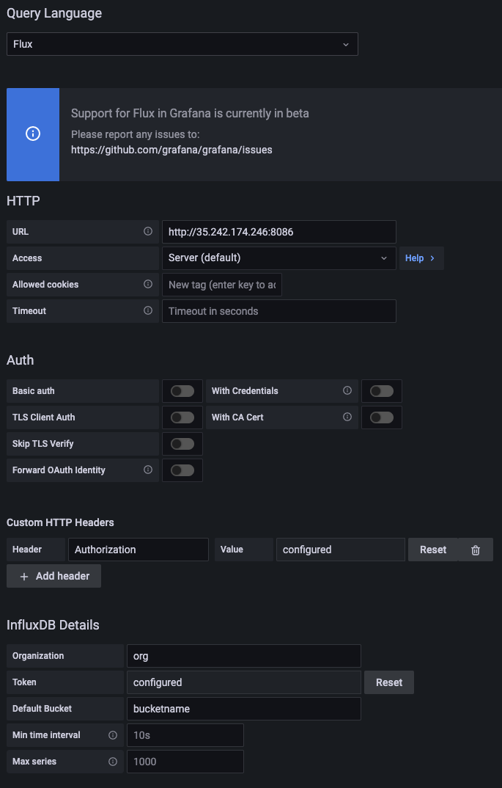
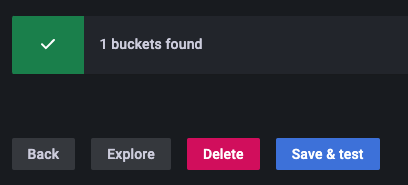
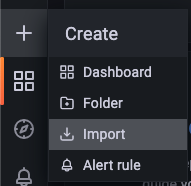
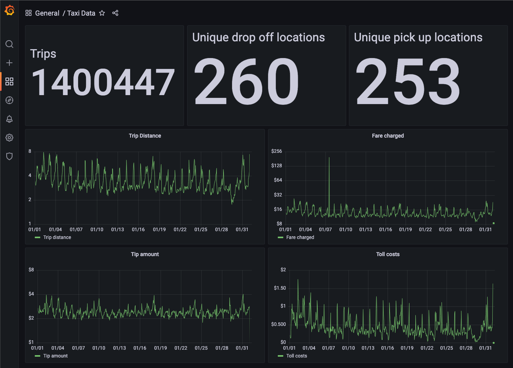

# Kubernetes, Grafana, InfluxDB Lab

This lab guide describes all the steps required to install Grafana and InfluxDB within Kubernetes. It also shows you how to convert a data file from a `.parquet` format into a `.csv` file and upload that `.csv` file to InfluxDB via telegraf. You will then create a Grafana dashboard to view the data.

The data file to be used is `yellow_tripdata_2022-01.parquet` which contains information describing taxi trips.

# Download Lab files into Google Cloud Console

To get started you will need to download the files in this repository. You can do this either on a local machine, or on a virtual machine, or even the Google Cloud Shell Editor.

You will need Git installed. Install instructions [here](https://git-scm.com/book/en/v2/Getting-Started-Installing-Git).

```sh
git clone https://github.com/GShuttleworth/data-lab
cd data-lab
```

# Setup Google Cloud Kubernetes cluster

In google cloud console:

Set region:

```sh
gcloud config set compute/region europe-west2
```

Create Google Kubernetes Engine autopilot cluster

> This will take a few minutes

```sh
gcloud container clusters create-auto data-lab-cluster
```

Check Kubernetes nodes are in `Ready` state.

```sh
kubectl get nodes
```

> There should be a few nodes created e.g.:
> 

# InfluxDB

## InfluxDB Install

In the Git repo you downloaded, there is a Kubernetes manifest file for InfluxDB that deploys InfluxDB into a Kubernetes pod. InfluxDB is deployed as a `statefulset` to provide the stability that InfluxDB requires.

> Note: It is not recommended to deploy InfluxDB into Kubernetes in production.

```sh
kubectl apply -f influxdb.yaml
```

Wait until the influxdb pod is showing as ready:

```sh
kubectl get pods -n influxdb
```

Once the pod is reporting ready, InfluxDB has been deployed with a public facing IP address.

To get the IP address, run:

```
kubectl get services -n influxdb
```

The public facing IP for InfluxDB is listed under `EXTERNAL-IP` with port 8086 mapped.

Go to `http://<influxdb-ip>:8086`

> It could take a few minutes before the UI becomes accessible.

## InfluxDB Setup

Now we have a working InfluxDB install with publicly facing UI we need to setup InfluxDB.

In the UI, click `Get Started` on the welcome screen.

Fill in the initial User screen:


> Take note of the details you enter, you'll need them later!

# Format Data file

In this lab we will upload a data file containing taxi trip data to InfluxDB.

This file is provided as a `.parquet` file which is a compressed data type that is not supported by InfluxDB.

To convert this file to a `.csv` which is supported by InfluxDB there is an included Python script `parquet-csv-converter.py`:

You will need to install Python3. See https://www.python.org/downloads/ for instructions.

Install Python libraries:

```bash
pip3 install pandas pyarrow fastparquet
```

Run `parquet-csv-converter.py`:

```sh
python3 parquet-csv-converter.py
```

This will create a `yellow_tripdata_2022-01.csv` file in the same directory.

# Upload data to InfluxDB

We will now upload the data `.csv` file we created. There is a custom telegraf configuration file `telegraf.conf` that will instruct telegraf to extract data from the `.csv` file and upload this to InfluxDB.

You will need an up to date install of telegraf. Install instructions can be found [here](https://portal.influxdata.com/downloads/).

There are some variables that need setting in the `telegraf.conf` file so that telegraf can connect to the InfluxDB instance.

Open `telegraf.conf` and edit these variables to match your influxDB instance:

```sh
  urls = ["http://<influx-ip>:8086"]
  token = "<token>"
  organization = "<org>"
  bucket = "<bucket-name>"
```

> You can setup a token through the InfluxDB UI by going to `Data --> Tokens --> Generate Token
> 

Run Telegraf once to upload the data to InfluxDB:

```sh
telegraf --config telegraf.conf -once
```

You will now see data in your InfluxDB bucket:

> 

# Install Grafana

In the Git repo you downloaded, there is a Kubernetes manifest file for Grafana that deploys Grafana into a Kubernetes pod and configures a persistent volume so Grafana can store data and maintain data persistence between pod restarts.

Apply the Grafana Kubernetes manifest that's stored in `grafana.yaml`:

```sh
kubectl apply -f grafana.yaml
```

Wait until the new Grafana pod is ready:

```sh
kubectl get pods
```

Once the pod is reporting ready, Grafana has been deployed with a public facing IP address.

To get the IP address, run:

```
kubectl get services -A
```

The public facing IP for Grafana is listed under `EXTERNAL-IP` with port 3000 mapped.

Go to `http://<grafana-ip>:3000`


The default login details are:

```
Username: admin
Password: admin
```

# Setup Grafana

## Add data source

Now Grafana is up and running we need to connect Grafana to retrieve data from InfluxDB.

To add a data source, go to `Configuration --> Data sources`.



Click `Add data source` and select `InfluxDB`

Add your details for InfluxDB:

- Select `Flux` as the query language.
- Add InfluxDB URL and port, e.g. `http://35.242.174.246:8086`
- Create a custom HTTP Header for authentication. Set header to `Authorization` and Value to `Token <your-influxdb-token>` - see [here](https://docs.influxdata.com/influxdb/cloud/security/tokens/create-token/#create-a-token-in-the-influxdb-ui) for instructions on creating InfluxDB tokens.
- Set Organization to the name of the organization you created in InfluxDB.
- Add your InfluxDB token into the token field.
- Add the name of your InfluxDB bucket into the Default Bucket field.



When done, click 'Save & test'. If everything works you will see a message saying you have '1 bucket found':



## Add Grafana Dashboard

Included in the lab is the Grafana dashboard file `dashboard.json` which contains a dashboard that you can import into Grafana.

To import the dashboard, in the Grafana UI click `create` then `import`.



Then upload the `dashboard.json` file.

You should now have a Dashboard showing data from InfluxDB about Taxi trips.


